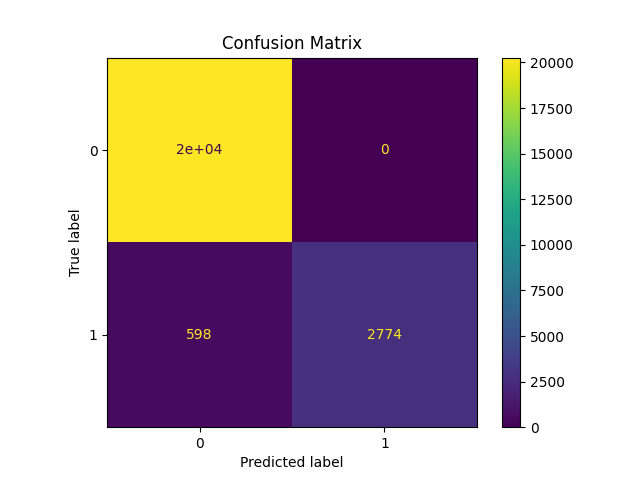

# Diabetes Risk Predictor

A simple AI-based binary classification system to predict the likelihood of diabetes using a perceptron model and 10-fold cross-validation.

---

## Features

- Binary classification of diabetes risk
- Perceptron-based model
- 10-fold cross-validation
- Confusion matrix visualization
- Accuracy tracking across folds

---

 
